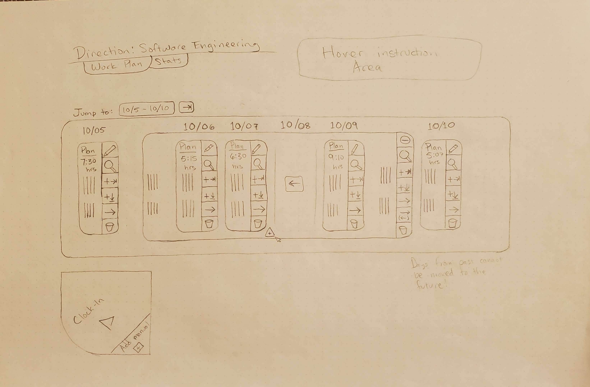
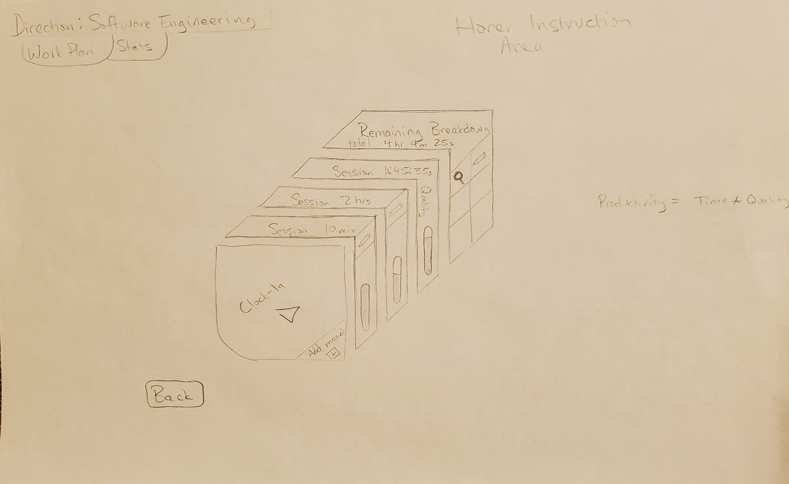
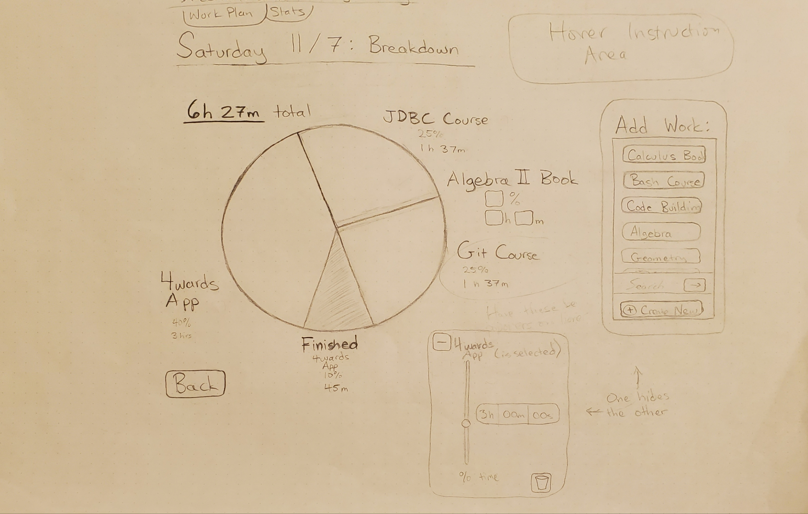
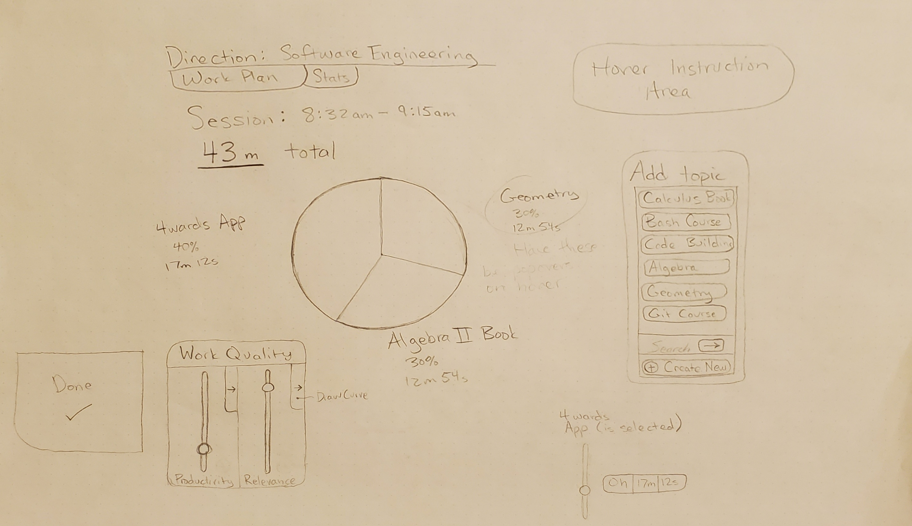
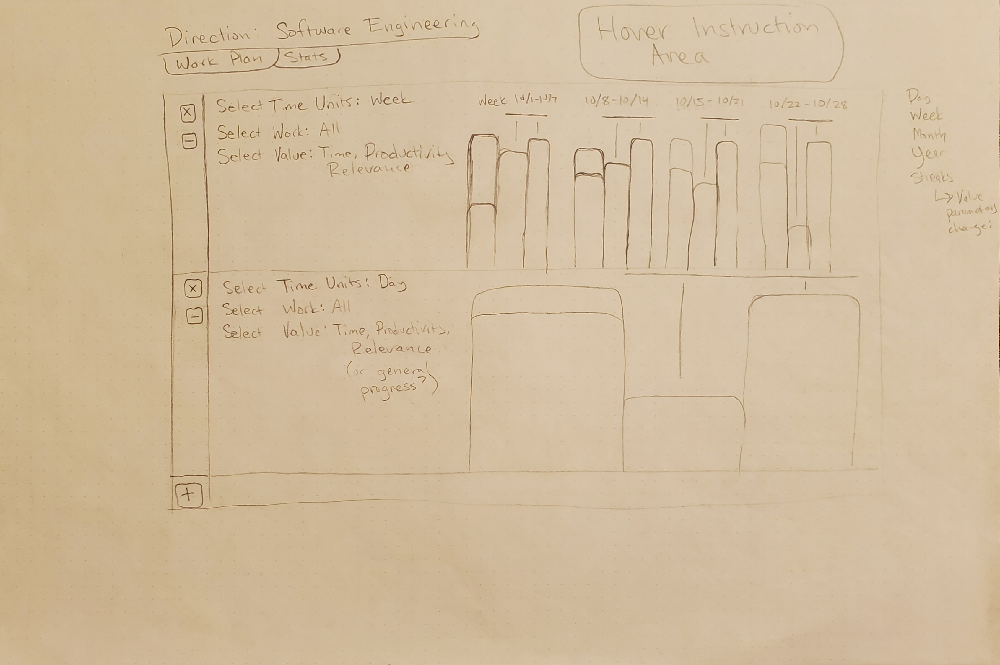

# Minimum Viable Product
### 4wards 
### 4wards has 7 windows
1. Days Editor
1. Plan Editor
1. Breakdown Editor
1. Clock-Out Editor
1. Stats View
1. User chooser
1. Direction chooser

It also has a segment called the "Start Area" that is displayed on 
multiple windows 

Current user and current direction are always shown at top, visible in any view. 

Two tabs are also always visible: "Work Plan" and "Stats"

### Days Editor
- Show all day plans created so far on a grid. The grid represents real 
calendar days in straight line
- Add a day (button at bottom of grid between any two day cells)
- Change date of day (by dragging to new slot on grid)
- Day cell features
    - Enter into day plan (edit button)
    - Remove a day cell, and thus its plan
    - Duplicate a day cell, and thus its plan
- "Jump to" button for calendar picker
- "Jump to latest" button
- Show start area button

(the drawing shows the presence of a "push", 
a grouping of days which can be moved around together. 
It also shows two different "duplicate cell" buttons
for flexibility and a "nudge right".
This feature is currently in the  
The drawing fails to show the presence of a way to add plan items)

### Plan Editor
- Show plan for day a user clicked. 
- Show a cell for each plan item (topic with associated time-goal)
- Plan Item cell features
    - Label showing focus topic of item
    - Enter into the day's breakdown (edit button)
    - Remove plan item
- Add plan item
- Show Start Area
-Back button (go back to days editor)

(Elaborate editor may not belong to MVP, and progress bars are grouped with it.
)

### Breakdown Editor
- Show breakdown of work completed and work planned in pie chart
- For each plan item, show duration and percentage of time
- Show total time planned
- Add plan items
- Create new topic
- Remove plan items
- Allow changing amount of time planned for each/any topic in plan
- Allow easy reduction of all plan items
- Back button (back to Plan Editor)

(Elaborate editor may not belong to MVP.
)

### Clock-Out Editor
- Reuse visuals from breakdown editor for benefit of user
- Show session time in pie chart
- Add topics (TimeAllotments) to session
- Create new topic
- Show duration of each topic and percentage
- Save session

(Elaborate editor may not belong to MVP.
)

### Stats View
- Show clock-time per time period as bar chart
- Choose week (last 7 days, 1 bar = 1 day), last month(last 28 days, 1 bar = 7 days), or 
year (calendar year to date, 1 bar = calendar month)
- Filter by topic (choose one or all)
- Filter by value (time, focus, productivity, or all)

(Drawing shows multi-pane viewing, which would allow two or more completely 
independent panes to be configured for comparing time periods, and/or topics, 
and/or values. It also shows multi value selection. Both of these features are
currently in )

### Start Area
- Provide convenient button for clocking-in
- Provide another button for adding manual time entry

### User chooser
- Simple dropdown without credentials (data stored locally)

### Direction chooser
- Simple dropdown with "add new button"