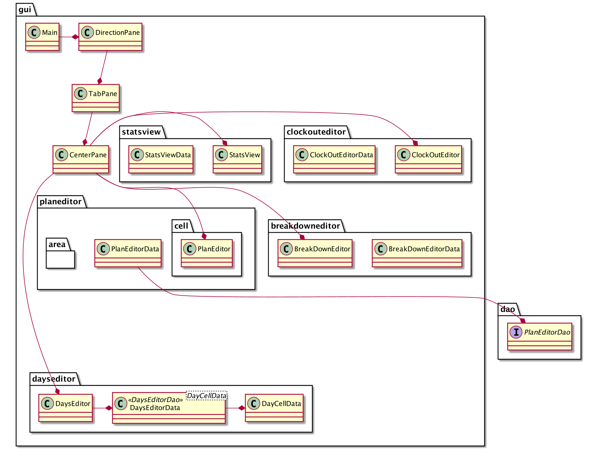
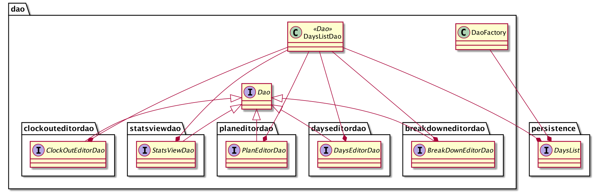
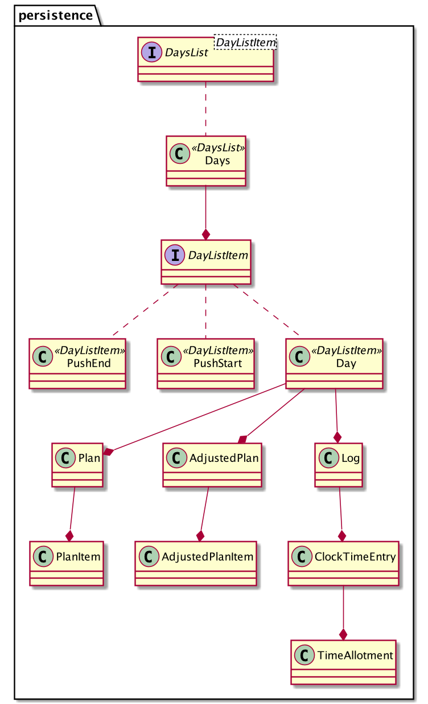
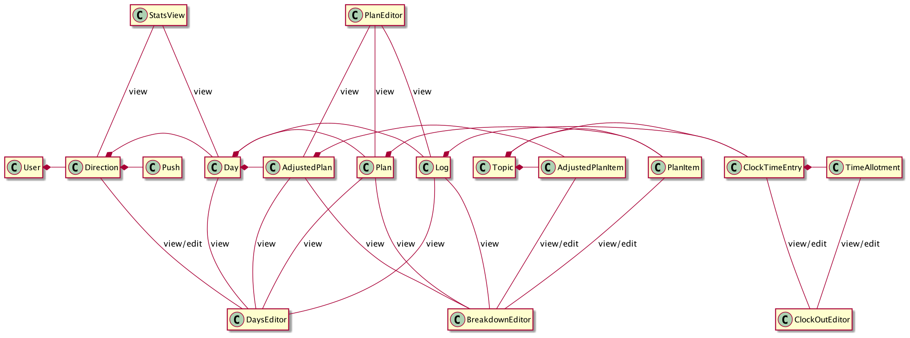
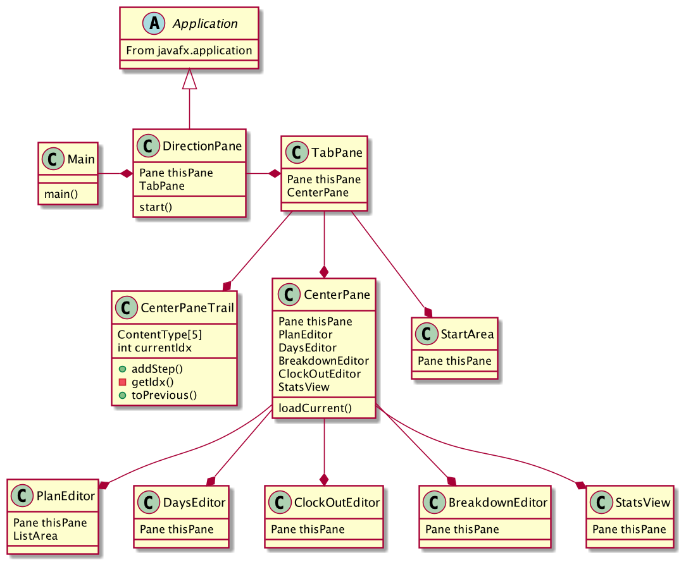
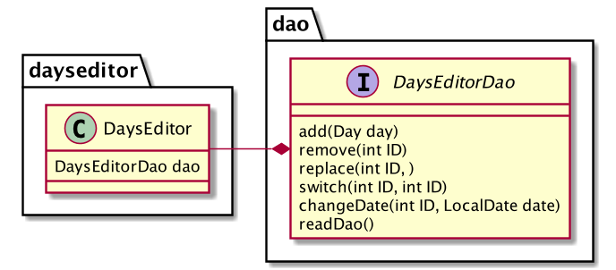
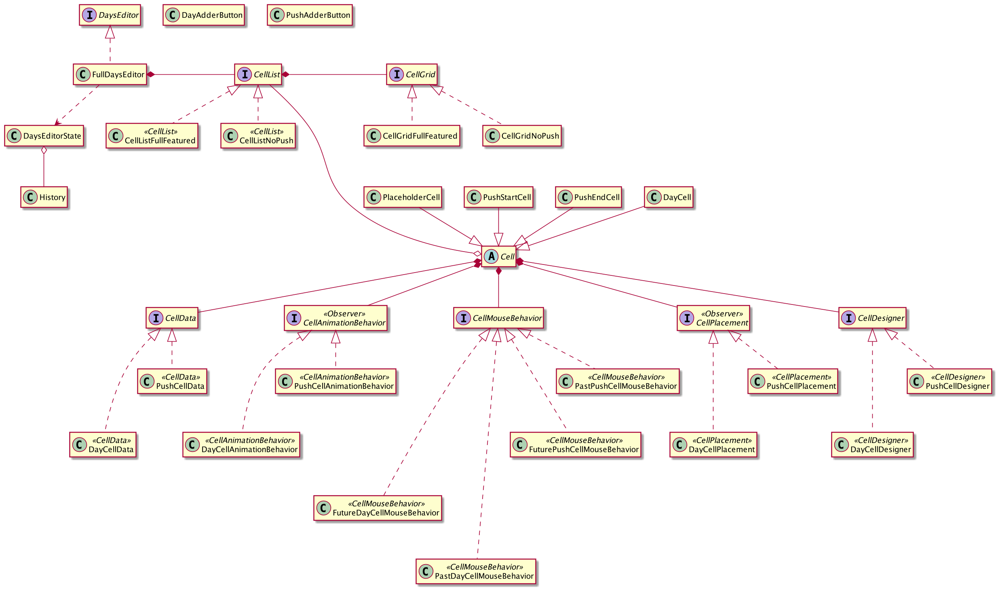
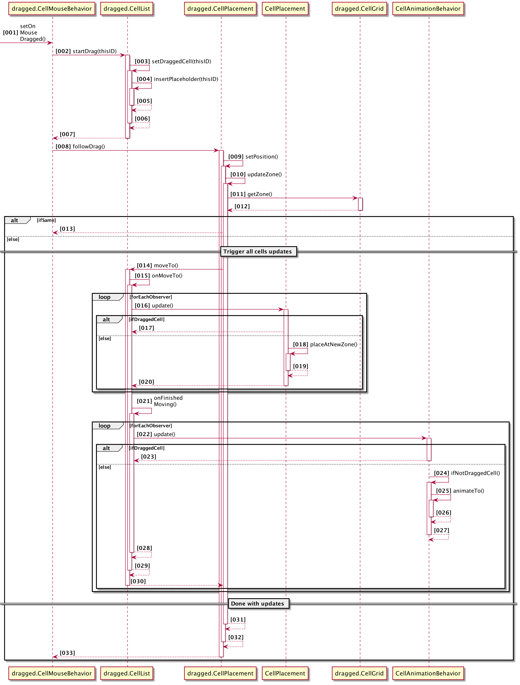
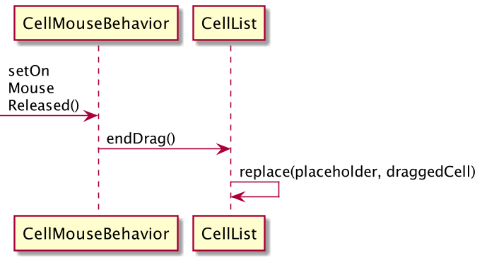

# Diagrams
These diagrams are here to give a taste of where the project is at currently. 
### GUI layer

### DAO layer

### Persistence layer

Shows where each of the 5 windows in the GUI package will need to get its data from.

This shows the hierarchy of panes to which each editor will belong. <!-- Flow chart needed!--> 

## Days Editor
This package is receiving attention before the other editors, since it is the first one a user would interact with, and also since it provides the most challenges. 

Shows how the DaysEditor class relates to Dao layer

Birdeye view of the dayseditor package

This the drag behavior of the day cells is arguably the biggest challenge in this editor. 

